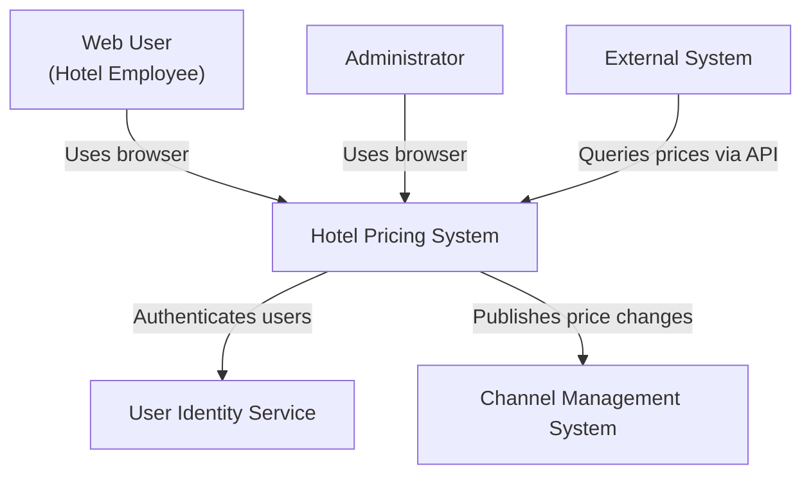
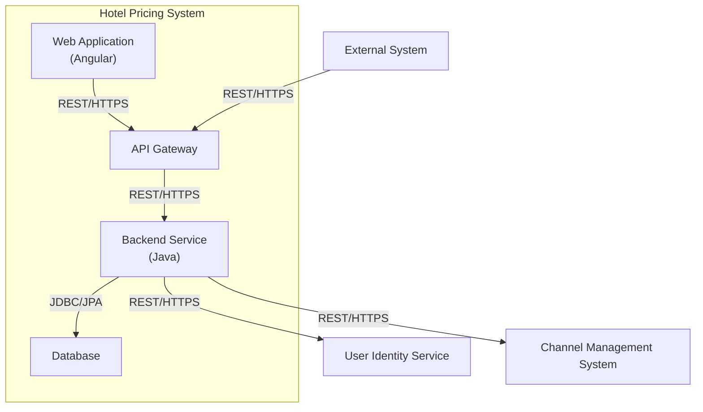
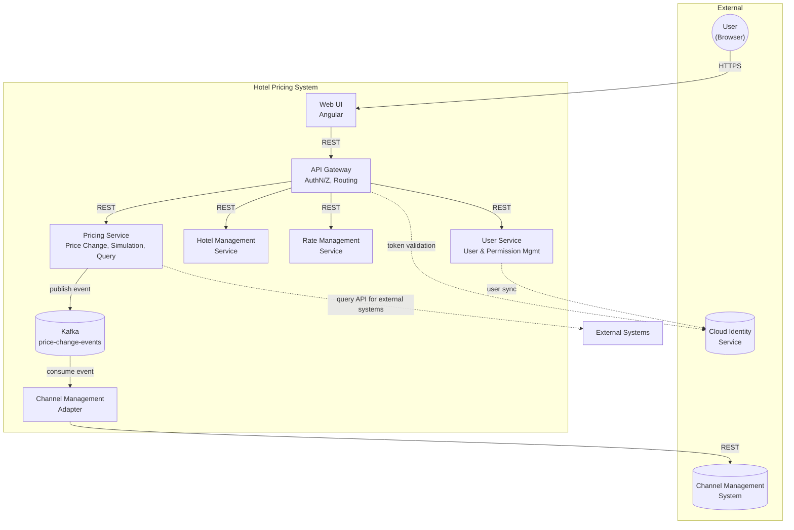
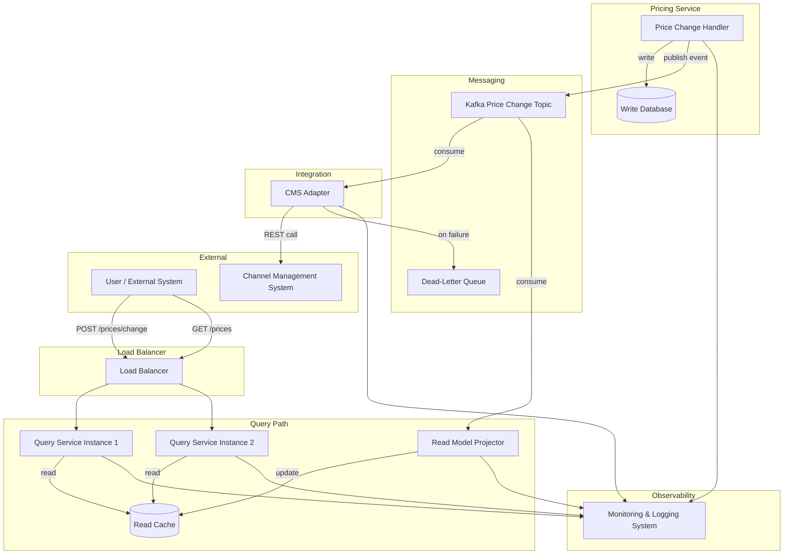
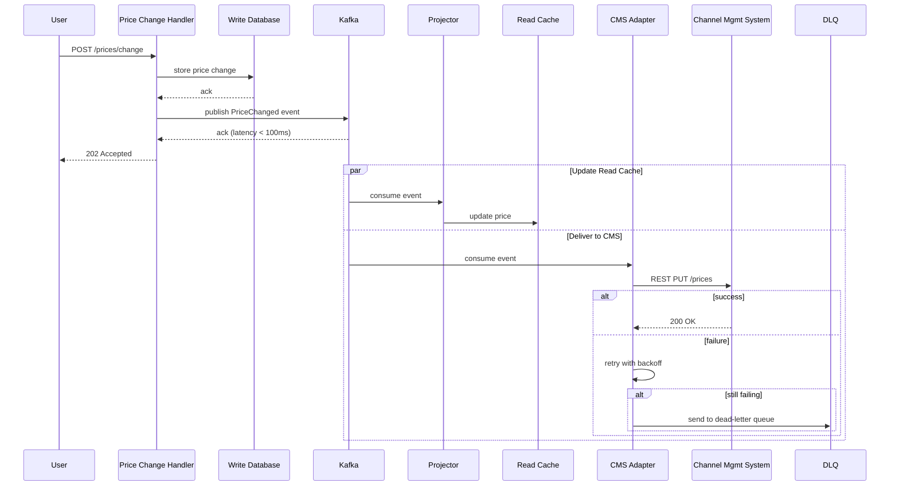
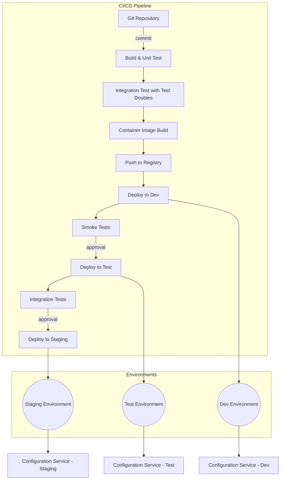
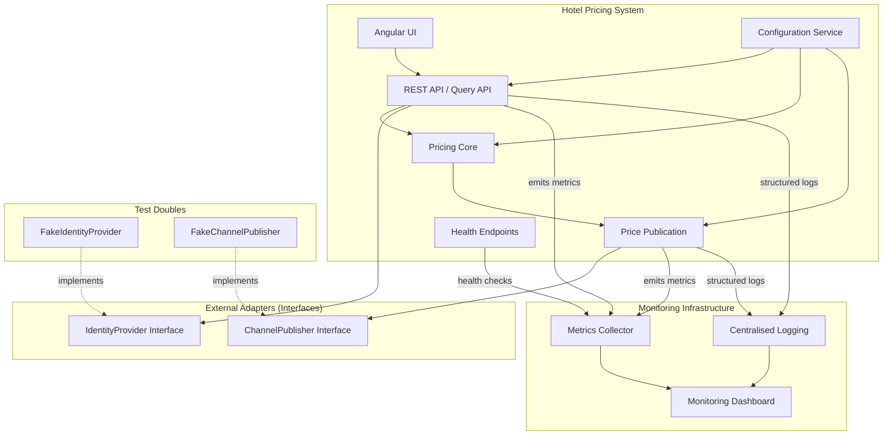

# Assignment 2 Report

## 1. Output results of ADD

ADD Step 1:
Review the assignment inputs and identify the architectural drivers from the provided prior knowledge.

The following results are reproduced from the completed single-agent run. Each iteration records the full ADD reasoning outcome for one refinement cycle.

### 1）Iteration 1: Establishing an Overall System Structure

## Iteration 1: Establishing an Overall System Structure

### Step 2 – Establish the Iteration Goal by Selecting Drivers

**Iteration Goal**  
Focus on the overall system structure and the primary architectural drivers. The aim is to create a high‑level decomposition that satisfies the most influential quality attributes, constraints, and concerns, providing a solid foundation for subsequent iterations.

**Selected Drivers**  
The following drivers are chosen because they directly shape the initial system structure and must be addressed from the very first decomposition:

| Driver | Rationale for Selection |
|--------|--------------------------|
| **QA‑5 Security** – only authorized functions are presented to each user after login | The structure must enforce a clear separation between authentication, authorisation, and business logic. This influences the placement of a security gateway and the internal design of the backend. |
| **QA‑6 Modifiability** – support a non‑REST query endpoint later without changing core components | The architecture must isolate integration points so that new protocols can be added without touching core business logic. This drives the use of adapters and well‑defined interfaces. |
| **QA‑7 Deployability** – application moves across nonproduction environments without code changes | The system must externalise all environment‑specific configuration. This affects how the application is packaged and how it connects to external services. |
| **QA‑9 Testability** – 100% of the system and its elements should support integration testing independently of external systems | The structure must allow components to be tested in isolation with mock external dependencies. This calls for clear component boundaries and dependency injection. |
| **CON‑1** – users interact through a web browser on multiple platforms and devices | A browser‑based frontend is mandatory, leading to a clear separation between a web client and a backend API. |
| **CON‑2** – manage users through a cloud provider identity service and host resources in the cloud | The system must integrate with an external identity service and be designed for cloud deployment, influencing the choice of cloud‑native patterns. |
| **CON‑5** – initial interaction with existing systems is through REST APIs and may later support other protocols | The integration layer must be abstracted so that the core system is not tied to REST. This reinforces the need for adapters. |
| **CON‑6** – favor a cloud‑native approach | The architecture should leverage cloud‑native principles such as externalised configuration, stateless components, and horizontal scalability. |
| **CRN‑2** – leverage the team’s knowledge about Java technologies, Angular, and Kafka | The technology stack is predetermined: Angular for the frontend, Java for the backend, and Kafka available for future use. The structure must accommodate these choices. |
| **CRN‑4** – avoid introducing technical debt | The initial decomposition must be clean and modular, avoiding a “big ball of mud” that would be costly to refactor later. |
| **CRN‑5** – set up a continuous deployment infrastructure | The system must be easy to build, test, and deploy automatically. A single deployable unit with externalised configuration simplifies the CI/CD pipeline. |

Other quality attributes (e.g., QA‑1 Performance, QA‑2 Reliability, QA‑3 Availability) will be addressed in later iterations when the detailed internal design is refined.

---

### Step 3 – Choose One or More Elements of the System to Refine

**System Context**  
The Hotel Pricing System interacts with the following external entities:

- **Web User** – a hotel employee using a browser to log in, change prices, query prices, and manage hotels/rates/users.
- **Administrator** – a privileged user performing management tasks via the same browser interface.
- **External System** – any third‑party system that queries prices through the provided Query API.
- **User Identity Service** – a cloud‑based identity provider that authenticates users and supplies identity tokens.
- **Channel Management System** – the external system that receives published price changes.

**Element to Refine**  
For this greenfield iteration, the **Hotel Pricing System itself** is selected for refinement. The system will be decomposed into high‑level architectural elements that together realise the required functionality while satisfying the selected drivers.

---

### Step 4 – Choose One or More Design Concepts That Satisfy the Selected Drivers

**Design Concept Alternatives**

1. **Layered Architecture (Modular Monolith)**  
   A single deployable backend application structured into presentation, business logic, data access, and integration layers. The frontend is a separate Angular application. An API gateway handles cross‑cutting concerns such as authentication.  
   *Strengths*: simple to develop, test, and deploy; aligns with team skills; low initial complexity; easy to externalise configuration.  
   *Weaknesses*: scaling is coarse‑grained; modules may become tightly coupled if not disciplined.

2. **Microservices Architecture**  
   Independent services for Pricing, Hotel Management, User Management, etc., each with its own database. An API gateway routes requests.  
   *Strengths*: independent deployability and scalability; strong module boundaries.  
   *Weaknesses*: high operational complexity; distributed system challenges; overkill for an MVP with a 2‑month deadline; requires significant infrastructure investment.

3. **Event‑Driven Architecture**  
   Services communicate primarily through asynchronous events (e.g., via Kafka).  
   *Strengths*: loose coupling; natural fit for reliability and scalability.  
   *Weaknesses*: added complexity for simple query/response scenarios; harder to reason about and test; not necessary for the initial structure.

**Selected Design Concept**  
**Modular Monolith with Layered Internals and an API Gateway** is chosen. The backend is a single Java application that is internally organised into distinct modules (Pricing, Hotel Management, User Management, Rate Management) with clear interfaces. An API gateway (cloud‑managed or a lightweight component) sits in front of the backend to handle authentication token validation and routing. The Angular frontend communicates only with the API gateway. Integration with external systems is encapsulated behind adapter interfaces, allowing future protocol changes without affecting core logic.

This concept best satisfies the selected drivers:
- **QA‑5 Security**: the API gateway enforces authentication; the backend enforces fine‑grained authorisation.
- **QA‑6 Modifiability**: adapters for external systems and query protocols can be swapped or added independently.
- **QA‑7 Deployability**: a single deployable unit with externalised configuration (environment variables, cloud configuration services) moves seamlessly across environments.
- **QA‑9 Testability**: each layer and module can be tested in isolation with mocked external adapters.
- **Constraints**: uses Angular + Java; cloud‑native through externalised config and stateless design; REST APIs initially; simple enough for a 2‑month MVP.
- **Concerns**: leverages team knowledge; avoids technical debt through modularity; supports continuous deployment with a single artifact.

---

### Step 5 – Instantiate Architectural Elements, Allocate Responsibilities, and Define Interfaces

**Instantiated Elements and Responsibilities**

| Element | Responsibility |
|---------|----------------|
| **Web Application (Angular)** | Provides the browser‑based user interface. Handles user interactions, renders authorised views, and calls the API gateway. |
| **API Gateway** | Validates identity tokens (from the User Identity Service), enforces coarse‑grained access control, routes requests to the backend, and may handle rate limiting. |
| **Backend Service (Java)** | Implements all business logic. Internally structured as: • **Controllers** – REST endpoints for each functional area. • **Services** – business rules for pricing, hotel management, rate management, user permissions. • **Domain Model** – core entities (Hotel, Rate, RoomType, Price, User). • **Repositories** – data access interfaces. • **Integration Adapters** – encapsulate communication with the User Identity Service and the Channel Management System. |
| **Database** | Persists hotel configurations, rates, prices, and user permission data. (User credentials are managed externally by the identity service.) |
| **User Identity Service (external)** | Authenticates users and issues tokens. |
| **Channel Management System (external)** | Receives published price changes via REST API. |

**Interfaces**

- **Web App ↔ API Gateway**: REST/HTTPS. The gateway exposes endpoints for login, price queries, price changes, and management operations. The web app includes the identity token in requests.
- **API Gateway ↔ Backend Service**: REST/HTTPS. The gateway forwards validated requests to the corresponding backend endpoints.
- **Backend Service ↔ Database**: JDBC/JPA (internal, not exposed externally).
- **Backend Service ↔ User Identity Service**: REST/HTTPS. The adapter calls the identity service to validate tokens or fetch user attributes.
- **Backend Service ↔ Channel Management System**: REST/HTTPS. The adapter publishes price changes to the channel management system’s API.
- **External System ↔ Query API**: REST/HTTPS. External systems can directly call the API gateway’s query endpoint (or a dedicated Query API if separated later).

**Mermaid Diagrams**

*System Context Diagram*

*Container Diagram (High‑Level Structure)*

---

### Step 6 – Verify Requirements and Design Decisions and Iterate if Necessary

**Verification Against Selected Drivers**

- **QA‑5 Security**: The API gateway validates tokens; the backend applies role‑based access control. Only authorised functions are exposed to the user after login.
- **QA‑6 Modifiability**: Integration adapters isolate external system communication. Adding a non‑REST query endpoint later only requires a new adapter and possibly a new controller, without changing core pricing logic.
- **QA‑7 Deployability**: All environment‑specific settings (database URLs, identity service endpoints, channel management URLs) are externalised. The same build artifact can be promoted from development to production.
- **QA‑9 Testability**: The layered structure allows unit testing of services with mocked repositories and adapters. Integration tests can replace external adapters with stubs, satisfying the 100% independent integration testing goal.
- **Constraints**: The design uses Angular and Java (CRN‑2), a web browser interface (CON‑1), cloud identity service (CON‑2), REST APIs initially (CON‑5), and cloud‑native externalised configuration (CON‑6). The modular monolith fits the 2‑month MVP timeline (CON‑4).
- **Concerns**: The clear module boundaries avoid technical debt (CRN‑4). A single deployable unit simplifies continuous deployment (CRN‑5). Kafka is not used yet but can be introduced later for reliability (CRN‑2).

No iteration is required at this stage; the high‑level structure adequately addresses the iteration goal.

---

### Step 7 – Document the Design Decisions and Rationale

**Key Decisions**

1. **Modular Monolith over Microservices**  
   *Rationale*: The MVP deadline (2 months) and team familiarity with Java/Angular favour a simpler deployment model. The internal modularisation preserves the ability to extract microservices later if scalability demands it.

2. **API Gateway as the Single Entry Point**  
   *Rationale*: Centralises authentication token validation, offloading this concern from the backend. It also provides a uniform interface for both the web app and external query systems, aligning with QA‑5 Security and QA‑6 Modifiability.

3. **Layered Backend with Adapter Pattern**  
   *Rationale*: Isolates business logic from external dependencies, enabling independent testability (QA‑9) and future protocol changes (QA‑6). The layers are a well‑understood pattern for the team.

4. **Externalised Configuration**  
   *Rationale*: Directly satisfies QA‑7 Deployability and the cloud‑native constraint (CON‑6). Environment variables or a cloud configuration service will be used.

5. **Deferral of Kafka**  
   *Rationale*: While the team knows Kafka, it is not required for the initial structure. It will be introduced in Iteration 3 when addressing reliability (QA‑2) and performance (QA‑1) for price publication.

These decisions establish a robust, evolvable skeleton that meets the primary architectural drivers and sets a clear direction for the next iterations.

---

### Self‑Reflection

- **Completeness**: All steps from 2 to 7 are explicitly covered. The selected drivers are justified, the system context is defined, design alternatives are evaluated, and the chosen concept is instantiated with clear responsibilities and interfaces.
- **Adherence to Prior Knowledge**: Only the provided requirements, quality attributes, constraints, and concerns are used. No external domain knowledge about hotel systems or pricing engines was introduced.
- **Mermaid Diagrams**: Two diagrams are included – a system context and a container view – both using valid Mermaid syntax.
- **Driver Satisfaction**: The design directly addresses every selected driver. The verification step confirms that no driver is overlooked.
- **Feasibility**: The modular monolith with an API gateway is a realistic starting point that respects the 2‑month MVP constraint and the team’s technology stack.
- **Potential Improvements**: In later iterations, the internal module boundaries could be further refined, and the API gateway might be replaced with a cloud‑native service (e.g., AWS API Gateway) for better scalability. The current design deliberately leaves these details open.

### 2）Iteration 2: Identifying Structures to Support Primary Functionality

## ADD Iteration 2: Identifying Structures to Support Primary Functionality

### Step 2 – Establish the Iteration Goal by Selecting Drivers
**Iteration Goal:** Refine the system structure to fully support the six primary use cases:  
- HPS‑1 Log In  
- HPS‑2 Change Prices (including simulation and publication)  
- HPS‑3 Query Prices (via UI and external API)  
- HPS‑4 Manage Hotels  
- HPS‑5 Manage Rates  
- HPS‑6 Manage Users  

The architectural drivers for this iteration are the primary functionality requirements themselves, together with the quality attributes that directly influence the decomposition:  
- QA‑5 (Security – only authorized functions presented after login)  
- QA‑6 (Modifiability – support a non‑REST query endpoint later without changing core components)  
- QA‑9 (Testability – 100 % of elements must support independent integration testing)  
- QA‑1 (Performance – price publication ready for query < 100 ms) and QA‑2 (Reliability – 100 % publication success) are considered to ensure the chosen structure can later accommodate the necessary mechanisms.

### Step 3 – Choose One or More Elements of the System to Refine
The element selected for refinement is the **Hotel Pricing System** as a whole, which was treated as a single black‑box element in Iteration 1. We decompose it into a set of collaborating architectural elements that directly realise the primary functionality. The external actors (User, Channel Management System, Cloud Identity Service) remain unchanged.

### Step 4 – Choose One or More Design Concepts That Satisfy the Selected Drivers
**Design concept alternatives considered:**
1. **Layered monolith** – presentation, business logic, data access layers in a single deployable unit.  
2. **Modular monolith** – functionally separated modules inside one runtime, with clear interfaces.  
3. **Microservices** – each functional area is an independently deployable service, communicating over lightweight protocols (REST, asynchronous messaging).  
4. **Event‑driven architecture** – services communicate primarily through events, with a broker mediating.

**Selected concept:** **Microservices combined with event‑driven messaging for price publication.**  
Rationale:
- **Primary functionality** maps naturally to separate bounded contexts (User, Hotel, Rate, Pricing), enabling independent development and alignment with team knowledge (CRN‑2: Java, Angular, Kafka).  
- **QA‑5 (Security):** An API Gateway can centralise authentication and enforce role‑based access, presenting only authorised functions.  
- **QA‑6 (Modifiability):** Decoupling the core pricing logic from its API layer allows adding a non‑REST query endpoint later by introducing a new adapter, without touching core components.  
- **QA‑9 (Testability):** Each service can be integration‑tested in isolation by mocking its external dependencies (other services, Kafka, identity provider).  
- **QA‑1 & QA‑2:** Using Kafka for price change events provides reliable, low‑latency propagation and decouples the publisher from the Channel Management System, enabling the required performance and reliability mechanisms in later iterations.  
- **Constraints:** Cloud‑native approach (CON‑6), REST APIs for existing systems (CON‑5), and the use of a cloud identity service (CON‑2) are all respected.

### Step 5 – Instantiate Architectural Elements, Allocate Responsibilities, and Define Interfaces
The following elements are instantiated from the selected design concept. Responsibilities are assigned to satisfy the primary functionality, and interfaces are defined.

| Element | Responsibility | Primary functionality covered | Key interfaces |
|---------|----------------|------------------------------|----------------|
| **Web UI (Angular)** | Provides the browser‑based user interface for all hotel staff and administrator functions. Communicates exclusively with the API Gateway. | HPS‑1, HPS‑2, HPS‑3, HPS‑4, HPS‑5, HPS‑6 (presentation layer) | REST/HTTP calls to API Gateway |
| **API Gateway** | Single entry point. Routes requests to backend services. Validates JWT tokens obtained from the cloud identity service. Enforces role‑based authorisation so that only permitted functions are visible/accessible (QA‑5). | HPS‑1 (token validation), HPS‑2–HPS‑6 (routing) | REST endpoints for UI; forwards requests to internal services via REST |
| **User Service** | Manages user accounts and permissions. Integrates with the cloud identity service for authentication (CON‑2). Stores user profiles and role assignments. | HPS‑6 Manage Users | REST API: `POST /users`, `PUT /users/{id}/permissions`, etc. |
| **Hotel Management Service** | Manages hotel master data, tax rates, and room types. | HPS‑4 Manage Hotels | REST API: `POST /hotels`, `PUT /hotels/{id}/taxrates`, `GET /roomtypes`, etc. |
| **Rate Management Service** | Manages rate definitions and rate calculation business rules. | HPS‑5 Manage Rates | REST API: `POST /rates`, `PUT /rates/{id}/rules`, `GET /rates`, etc. |
| **Pricing Service** | Core pricing logic. Handles price changes (base rate / fixed rate), simulation of changes, and publication. Answers price queries from the UI and external systems. Emits `PriceChangeEvent` to Kafka when a change is published. | HPS‑2 Change Prices, HPS‑3 Query Prices | REST API: `POST /prices/change` (with simulate flag), `GET /prices?hotelId=...`; Kafka topic `price-change-events` (producer); internal `PriceQueryInterface` (to allow future non‑REST adapters) |
| **Channel Management Adapter** | Consumes `PriceChangeEvent` from Kafka and reliably forwards the price update to the external Channel Management System via REST (CON‑5). Ensures at‑least‑once delivery. | HPS‑2 (publication part) | Kafka consumer on `price-change-events`; REST calls to CMS |
| **Cloud Identity Service (external)** | Authenticates users, issues tokens. Used by API Gateway and User Service. | HPS‑1 (authentication) | OAuth2 / OpenID Connect endpoints |

**Data stores:** Each service owns its private database (not shown in the component diagram to keep focus on functional structure). This ensures loose coupling and independent deployability.

### Step 6 – Sketch Views and Record Design Decisions
The following Mermaid component diagram captures the refined structure, the allocated responsibilities, and the primary interactions.

**Key design decisions recorded:**
- The API Gateway is the only component exposed to the Web UI; all backend services are internal.
- The Pricing Service exposes a synchronous REST API for queries and an internal `PriceQueryInterface` that can be implemented by a future non‑REST adapter (addressing QA‑6).
- Price publication is asynchronous via Kafka, decoupling the Pricing Service from the Channel Management Adapter and allowing independent scaling and reliability mechanisms.
- Each service is a separate deployable unit, enabling independent testing (QA‑9) and alignment with the cloud‑native constraint (CON‑6).

### Step 7 – Perform Analysis of Current Design and Review Iteration Goal
**Self‑reflection and analysis:**

- **Primary functionality coverage:** Every use case (HPS‑1 to HPS‑6) is explicitly assigned to one or more elements. The flow for login, price change, query, and management operations is fully traceable.
- **Quality attribute considerations:**
  - *QA‑5 (Security):* The API Gateway centralises authorisation; the UI only receives capabilities corresponding to the user’s role. This satisfies the requirement.
  - *QA‑6 (Modifiability):* The `PriceQueryInterface` inside the Pricing Service isolates the core logic from the transport. Adding a non‑REST endpoint later requires only a new adapter implementation, leaving the core unchanged.
  - *QA‑9 (Testability):* Every service can be tested in isolation by replacing external dependencies (Kafka, identity service, other services) with test doubles. The clear interface boundaries support this.
  - *QA‑1 (Performance) and QA‑2 (Reliability):* The structure introduces Kafka for price publication, which is the foundation for achieving <100 ms propagation (via local caching in the Pricing Service) and 100 % reliable delivery (via persistent queues and retries in the adapter). These mechanisms will be detailed in Iteration 3.
- **Constraints and concerns:**
  - CON‑2 (cloud identity) and CON‑5 (REST for existing systems) are respected.
  - CRN‑2 (team knowledge) is leveraged: Java for services, Angular for UI, Kafka for messaging.
  - The decomposition creates well‑bounded work packages that can be allocated to different team members (CRN‑3).
- **Potential risks:** The microservices style introduces complexity in deployment, service discovery, and configuration management. These operational concerns are explicitly deferred to Iteration 4 (Addressing Development and Operations), which will set up the continuous deployment infrastructure (CRN‑5) and address deployability (QA‑7). The current iteration deliberately focuses on functional structure, keeping the design ready for those later refinements.

**Conclusion:** The refined structure fully satisfies the iteration goal. All primary functionalities are supported by clearly defined elements with well‑allocated responsibilities and interfaces. The design establishes a solid baseline for the subsequent iterations that will tackle reliability, availability, and operational concerns.

### 3）Iteration 3: Addressing Reliability and Availability Quality Attributes

**Iteration 3: Addressing Reliability and Availability Quality Attributes**

### Step 2: Establish the Iteration Goal by Selecting Drivers
The iteration goal is to refine the design to satisfy reliability, availability, performance, and observability concerns. The architectural drivers selected for this iteration are:

- **QA-2 (Reliability):** 100% of price changes must be published successfully and received by the Channel Management System.
- **QA-3 (Availability):** Pricing queries uptime SLA must be 99.9% outside maintenance windows.
- **QA-1 (Performance):** Price publication after a base rate change must be ready for query in less than 100 ms.
- **QA-8 (Monitorability):** Operation can collect 100% of performance and reliability measures for price publication.

These drivers directly shape the refinement of the elements responsible for price publication, query handling, and system observability.

### Step 3: Choose One or More Elements of the System to Refine
Based on the previous iteration (Iteration 2) that established the overall system structure, the following elements are selected for refinement:

- **Pricing Service** – the core component that processes price changes, calculates rates, and initiates publication.
- **Price Publication Pipeline** – the flow from a price change request to the Channel Management System (CMS) receiving the update.
- **Query Service** – the component that serves pricing queries to users and external systems.
- **Integration Adapter for CMS** – the boundary element that communicates with the external CMS.
- **Data Stores** – the persistence layer that holds pricing data and supports both read and write operations.

Refining these elements will allow us to embed reliability, availability, and performance mechanisms directly into the critical path.

### Step 4: Choose One or More Design Concepts That Satisfy the Selected Drivers
The following design concepts are chosen to address the drivers:

1. **Event-Driven Reliable Publication with Kafka**  
   - *Drivers:* QA-2, QA-1  
   - *Rationale:* A durable message broker (Apache Kafka) guarantees at-least-once delivery. The Pricing Service publishes price change events to a Kafka topic; the CMS Adapter consumes them and forwards to the CMS with retries. This decouples the write path and ensures no change is lost, while keeping the initial write latency low (<100 ms).

2. **CQRS with Separate Read and Write Stores**  
   - *Drivers:* QA-3, QA-1  
   - *Rationale:* Command Query Responsibility Segregation separates the write model (transactional, consistent) from the read model (optimized for queries). After a price change is persisted, an asynchronous projector updates a read‑optimised cache (e.g., Redis or a read replica). Queries are served from this cache, enabling high availability and low latency even under load.

3. **Redundant, Auto‑Scaled Service Instances**  
   - *Drivers:* QA-3  
   - *Rationale:* Deploy multiple instances of the Query Service and the CMS Adapter behind a load balancer. Health checks and auto‑scaling groups maintain the required capacity, achieving 99.9% uptime.

4. **Circuit Breaker and Retry for External Calls**  
   - *Drivers:* QA-2, QA-3  
   - *Rationale:* The CMS Adapter uses a circuit breaker to prevent cascading failures when the CMS is slow or unavailable. Combined with a dead‑letter queue, it ensures that after transient failures, messages are eventually delivered.

5. **Comprehensive Observability Stack**  
   - *Drivers:* QA-8  
   - *Rationale:* All components emit structured logs, metrics (e.g., publication latency, success/failure counts), and distributed traces. A centralised monitoring system collects these measures, fulfilling the 100% collection requirement.

### Step 5: Instantiate Architectural Elements, Allocate Responsibilities, and Define Interfaces
The selected design concepts are instantiated by refining the elements and assigning clear responsibilities.

**Refined Elements and Responsibilities:**

- **Price Change Handler (inside Pricing Service)**  
  - Receives price change requests via REST API.  
  - Validates the request and applies business rules (rate calculation).  
  - Persists the change to the **Write Database** (e.g., PostgreSQL) and publishes a `PriceChanged` event to the **Kafka Price Change Topic**.

- **Write Database**  
  - Stores the authoritative current price state.  
  - Supports transactional writes.

- **Kafka Price Change Topic**  
  - Durable, partitioned log of price change events.  
  - Guarantees ordering within a hotel/rate key.

- **CMS Adapter**  
  - Consumes events from the Kafka topic.  
  - Transforms the event into the CMS‑specific REST call.  
  - Implements retry with exponential backoff and a circuit breaker.  
  - On final failure, moves the event to a **Dead‑Letter Queue** for manual inspection.  
  - Exposes health and metrics endpoints.

- **Read Model Projector**  
  - Listens to the same Kafka topic (or a change‑data‑capture stream from the Write Database).  
  - Updates the **Read Cache** (e.g., Redis) with the latest prices.  
  - Ensures eventual consistency; the cache is ready for queries within the 100 ms performance window.

- **Query Service**  
  - Serves pricing queries via a REST API and (in future) other protocols.  
  - Reads exclusively from the Read Cache.  
  - Deployed in multiple instances behind a load balancer.  
  - Implements a fallback to the Write Database if the cache is unavailable (graceful degradation).

- **Load Balancer & Health Checks**  
  - Distributes traffic across Query Service instances.  
  - Removes unhealthy instances automatically.

- **Observability Agents**  
  - Sidecar/agent attached to each service instance.  
  - Collects logs, metrics (e.g., publication latency, success rate), and traces.  
  - Forwards to a central monitoring system (e.g., ELK, Prometheus).

**Interfaces:**

- `POST /prices/change` – REST endpoint for price changes (secured, only for authorized users).  
- `GET /prices?hotel=...&rate=...` – Query API for internal/external consumers.  
- Kafka topic `hotel.price.change` – event schema: `{ hotelId, rateId, newPrice, timestamp, correlationId }`.  
- CMS REST API – called by the CMS Adapter (existing system interface).  
- Health endpoints: `/health`, `/metrics` on each service.

### Step 6: Sketch Views and Record Design Decisions

**Component Diagram (Mermaid)**  
The following diagram shows the refined architecture with the new elements and their interactions.

**Sequence Diagram for Price Publication (Mermaid)**  
Illustrates the reliable, asynchronous flow that meets QA-2 and QA-1.

**Key Design Decisions Recorded:**

- **DD-3.1:** Use Apache Kafka as the reliable event backbone for price publication.  
- **DD-3.2:** Apply CQRS with a Redis read cache to meet query performance and availability targets.  
- **DD-3.3:** Deploy Query Service and CMS Adapter with at least two instances behind a load balancer, with auto‑scaling policies.  
- **DD-3.4:** Implement a circuit breaker (e.g., Resilience4j) in the CMS Adapter to handle CMS unavailability.  
- **DD-3.5:** All services expose health, metrics, and tracing endpoints; a centralised observability platform (ELK/Prometheus) collects 100% of publication measures.

### Step 7: Perform Analysis of Current Design and Review Iteration Goal

**Self‑Reflection and Analysis:**

- **QA-2 (Reliability):** The design guarantees that every price change is durably stored in Kafka before acknowledging the user. The CMS Adapter consumes with at‑least‑once semantics and retries until success; the dead‑letter queue captures any permanently undeliverable events for manual intervention. This ensures 100% publication success as required.
- **QA-3 (Availability):** The Query Service is stateless and can be scaled horizontally behind a load balancer. The read cache is a dedicated, highly available store (Redis with sentinel/cluster). Even if the write path or CMS is temporarily down, queries remain available. Combined with health checks and auto‑healing, the 99.9% uptime SLA is achievable.
- **QA-1 (Performance):** The price change handler writes to the database and publishes to Kafka synchronously; Kafka acknowledgements are typically in single‑digit milliseconds. The asynchronous projector updates the cache almost immediately, so the new price is queryable well within 100 ms. The query path reads directly from the cache, providing sub‑millisecond responses.
- **QA-8 (Monitorability):** Every component emits structured logs and metrics (publication latency, success/failure counts, cache update lag). The observability agents collect these without gaps, satisfying the 100% collection requirement.
- **Cross‑cutting concerns:** The design remains aligned with the team’s knowledge (Java, Angular, Kafka – CRN-2) and cloud‑native constraints (CON-6). The separation of concerns supports independent testing (QA-9) because the CMS Adapter, projector, and query service can be tested with mock Kafka topics and a fake CMS.

The iteration goal is fully satisfied. The refined architecture now robustly addresses reliability, availability, performance, and observability, providing a solid foundation for the next iteration (Development and Operations).

### 4）Iteration 4: Addressing Development and Operations

## Iteration 4: Addressing Development and Operations

### Step 2: Establish the Iteration Goal by Selecting Drivers
The iteration goal is to refine the design to support **deployability**, **testability**, **monitorability**, and **development workflow** concerns. The following architectural drivers are selected:

- **QA-7 Deployability**: Application moves across nonproduction environments without code changes.
- **QA-8 Monitorability**: Operation can collect 100% of performance and reliability measures for price publication.
- **QA-9 Testability**: 100% of the system and its elements should support integration testing independently of external systems.
- **CRN-3 Allocate work to members of the development team**.
- **CRN-4 Avoid introducing technical debt**.
- **CRN-5 Set up a continuous deployment infrastructure**.
- **CON-2** Manage users through a cloud provider identity service and host resources in the cloud.
- **CON-3** Code must be hosted on the proprietary Git-based platform.
- **CON-4** Initial release in 6 months and MVP in at most 2 months.
- **CON-6** Favor a cloud-native approach.

### Step 3: Choose One or More Elements of the System to Refine
The entire **Hotel Pricing System** is selected for refinement, with particular focus on:
- The **deployment architecture** (how the system is packaged, configured, and promoted across environments).
- The **internal component structure** to enable testability and monitorability.
- The **interfaces with external systems** (User Identity Service, Channel Management System) to allow independent testing.
- The **price publication flow** because it is the critical path for monitorability (QA-8).

### Step 4: Choose One or More Design Concepts That Satisfy the Selected Drivers
The following design concepts are chosen:

| Driver | Design Concept | Rationale |
|--------|----------------|-----------|
| QA-7 Deployability | **Externalized configuration** and **containerization** | Environment-specific settings (URLs, credentials) are injected at runtime, not baked into the build artifact. Containers ensure identical runtime behaviour across environments. |
| QA-9 Testability | **Dependency inversion** and **interface-based design** for all external integrations | External services are accessed through interfaces, allowing test doubles to replace them during integration testing. |
| QA-8 Monitorability | **Instrumentation of the price publication flow** with metrics and structured logging | Every step of the publication (validation, simulation, publishing) emits latency, success/failure counters, and correlation IDs. |
| CRN-5, CON-6 | **Cloud-native CI/CD pipeline** with automated build, test, and deployment stages | The pipeline is triggered by Git commits, runs unit and integration tests, and promotes the container image through nonproduction environments. |
| CRN-3, CRN-4 | **Modular architecture** aligned with team boundaries | The system is decomposed into independently buildable modules (e.g., pricing core, API, UI) so that teams can work in parallel without introducing technical debt. |
| CON-4 (MVP) | **Feature toggles** and **incremental delivery** | New functionality can be hidden behind toggles, allowing early deployment of the MVP while continuing development. |

### Step 5: Instantiate Architectural Elements, Allocate Responsibilities, and Define Interfaces
New and refined elements are introduced:

1. **Deployment Pipeline**  
   - *Responsibility*: Automates build, test, container image creation, and promotion across `dev`, `test`, `staging` environments.  
   - *Interfaces*: Listens to Git repository webhooks; triggers test suites; pushes images to a container registry; invokes deployment to cloud infrastructure.

2. **Configuration Service**  
   - *Responsibility*: Provides environment-specific configuration values (API endpoints, feature flags, logging levels) to all application components at startup.  
   - *Interfaces*: Exposes a REST endpoint or uses environment variables injected by the container orchestrator.

3. **Monitoring Service**  
   - *Responsibility*: Collects, aggregates, and visualises metrics and logs from all system components.  
   - *Interfaces*: Accepts metrics via a push gateway (e.g., Prometheus) and logs via a centralised logging agent (e.g., Fluentd). Each application component exposes a `/health` and `/metrics` endpoint.

4. **Refined External Integrations**  
   - **User Identity Service Adapter** – implements an `IdentityProvider` interface; a test double (`FakeIdentityProvider`) is provided for integration testing.  
   - **Channel Management System Adapter** – implements a `ChannelPublisher` interface; a test double (`FakeChannelPublisher`) records published prices and simulates success/failure.  
   - **Query API** – remains as defined, but now includes a `/health` endpoint and emits request metrics.

5. **Price Publication Component** (refined)  
   - *Added responsibilities*: Emit a `PricePublicationEvent` to a monitoring topic (Kafka) containing latency, status, and correlation ID. Log structured messages at each step.

6. **Test Harness**  
   - *Responsibility*: Provides a set of integration tests that run against the system with all external adapters replaced by test doubles.  
   - *Interfaces*: A test runner that can be executed in the CI pipeline without requiring real external systems.

### Step 6: Sketch Views and Record Design Decisions

#### Deployment Pipeline View (Mermaid)

#### Monitoring and Testability Component View (Mermaid)

**Design Decisions Recorded:**
- **DD-4.1**: All external service integrations are abstracted behind interfaces (`IdentityProvider`, `ChannelPublisher`) to enable test doubles and satisfy QA-9.
- **DD-4.2**: Configuration is fully externalised and injected via environment variables or a cloud-native configuration service, ensuring deployability (QA-7).
- **DD-4.3**: The price publication flow is instrumented with a mandatory `PricePublicationEvent` that captures latency, success/failure, and correlation ID; this event is sent to a monitoring topic (Kafka) and logged, satisfying QA-8.
- **DD-4.4**: A CI/CD pipeline is established using the proprietary Git platform’s webhooks, automated build, and container promotion through dev, test, and staging environments (CRN-5, CON-3, CON-6).
- **DD-4.5**: The system is structured into independently buildable modules (UI, API, Core, Publication) to allow parallel team work and avoid technical debt (CRN-3, CRN-4).

### Step 7: Analyze Current Design and Review Iteration Goal
**Self-Reflection:**
- **Deployability (QA-7)**: The externalised configuration and containerisation ensure that the same build artifact can be promoted across environments without code changes. The pipeline automates this promotion.
- **Testability (QA-9)**: Every external dependency is behind an interface, and test doubles are explicitly provided. The integration test suite can run entirely without real external systems, satisfying the 100% independent testability requirement.
- **Monitorability (QA-8)**: The price publication flow is fully instrumented; every publication attempt generates a metric event and structured log. The monitoring service collects these, enabling 100% measurement of performance and reliability.
- **Development Workflow (CRN-3, CRN-4, CRN-5)**: The modular decomposition aligns with team boundaries, the CI/CD pipeline is defined, and the use of interfaces and test doubles prevents technical debt from creeping in. The MVP constraint (CON-4) is addressed by feature toggles and incremental delivery, though the toggles themselves are not detailed here – they can be added as a configuration item.
- **Constraints**: Cloud-native approach (CON-6) is respected through containerisation and cloud-hosted pipeline. Git-based hosting (CON-3) is used as the trigger. The identity service remains a cloud provider service (CON-2).

No driver is left unaddressed. The design iteration successfully refines the system to meet the development and operations quality attributes and concerns.

---
**Final Answer:** The refined architecture now includes a deployment pipeline, externalised configuration, monitoring instrumentation, and testability interfaces, as shown in the Mermaid diagrams above. All selected drivers are satisfied.

## 2. Interaction cost analysis

| Item | Value |
| --- | --- |
| The way of completing the assignment | Single-agent |
| The LLM used | deepseek-v4-pro-260425 |
| Number of Human Interactions（turns） | 1 |
| Token Consumption（K tokens） | 21.10 |
| Time Cost（min） | 15.97 |

The figures above come from the successful real run executed in the current local environment.
